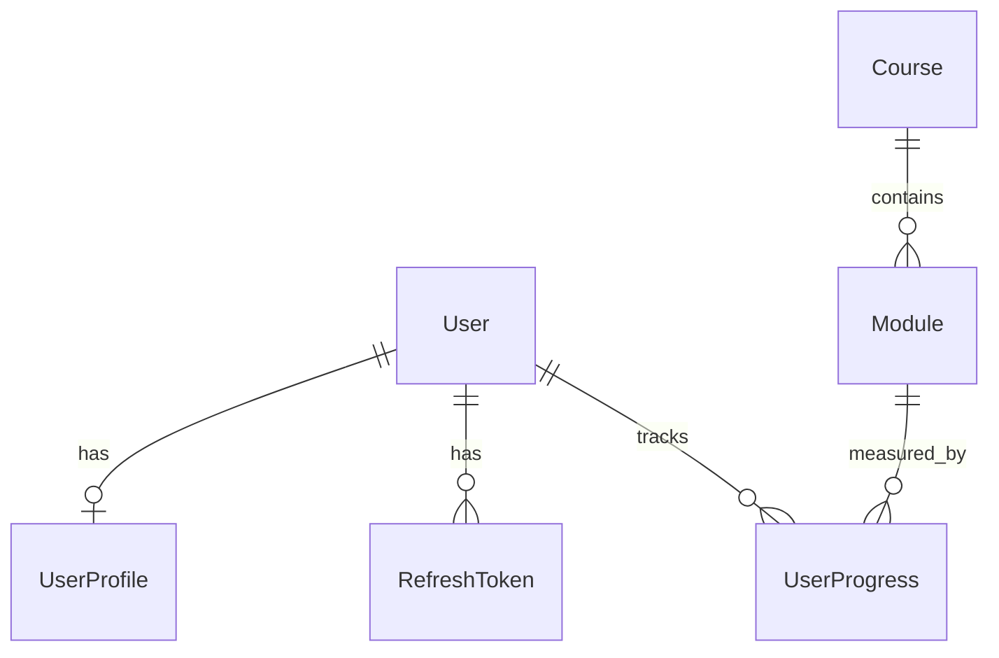

# AprenderJá — Documentação do Banco de Dados

## Visão geral

PostgreSQL com Prisma ORM. Schema principal em `prisma/schema.prisma` (cópia espelhada em `database/prisma/schema.prisma`).

## Entidades

| Tabela | Descrição |
|--------|-----------|
| `User` | Conta do aluno (nome, e-mail, senha hasheada) |
| `UserProfile` | Preferências individuais (ritmo, pausa semanal) |
| `RefreshToken` | Sessões persistentes com revogação |
| `Course` | Cursos disponíveis na plataforma |
| `Module` | Módulos de cada curso |
| `UserProgress` | Progresso por usuário e módulo (isolado por conta) |

## Diagrama ER



## Setup

```bash
# 1. Configure DATABASE_URL no .env
cp .env.example .env

# 2. Instale dependências
bun install

# 3. Aplique o schema
bun run db:push

# 4. Popule o curso inicial
bun run db:seed
```

## Seeds

O script `database/seed.ts` cria o curso **Fundamentos de Análise de Dados** com 6 módulos, idempotente (não duplica se já existir).

## Isolamento por usuário

- `UserProgress.userId` garante que cada aluno vê apenas seu progresso
- APIs validam JWT e comparam `auth.userId` com o recurso solicitado
- Perfil (`UserProfile`) é 1:1 com usuário

## Migrações

Em produção, prefira:

```bash
bun run db:migrate
```

Em desenvolvimento rápido:

```bash
bun run db:push
```
