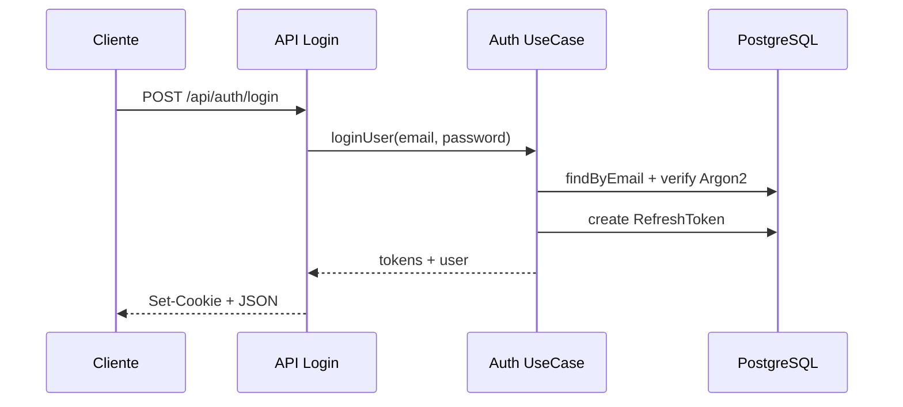

# Arquitetura — AprenderJá

## Visão macro

Aplicação **full-stack monorepo** com TanStack Start. Frontend e backend compartilham o mesmo deploy, mas estão **separados logicamente** em camadas distintas.

```
┌─────────────────────────────────────────────────────────┐
│                    Cliente (Browser)                     │
│  React + TanStack Router + AuthContext + Hooks         │
└─────────────────────────┬───────────────────────────────┘
                          │ HTTP (cookies + JSON)
┌─────────────────────────▼───────────────────────────────┐
│              TanStack Start — API Routes                 │
│         (Controllers finos em src/routes/api/)           │
└─────────────────────────┬───────────────────────────────┘
                          │
┌─────────────────────────▼───────────────────────────────┐
│                   Backend (src/backend/)                 │
│  Use Cases → Services → Repositories → Prisma            │
└─────────────────────────┬───────────────────────────────┘
                          │
┌─────────────────────────▼───────────────────────────────┐
│                   PostgreSQL                             │
└─────────────────────────────────────────────────────────┘
```

## Camadas backend

| Camada | Responsabilidade | Exemplo |
|--------|------------------|---------|
| **Routes (API)** | HTTP, parsing, status codes | `backend/routes/api.router.ts` |
| **Use Cases** | Orquestração de regras | `usecases/auth/auth.usecase.ts` |
| **Services** | Lógica técnica reutilizável | `services/auth/password.service.ts` |
| **Repositories** | Acesso a dados | `repositories/user.repository.ts` |
| **Middlewares** | Auth, validação transversal | `middlewares/auth.middleware.ts` |
| **Utils** | JWT, cookies, response helpers | `utils/jwt.ts` |

## Camadas frontend

| Camada | Responsabilidade |
|--------|------------------|
| **Routes (pages)** | Composição de telas |
| **Components** | UI reutilizável (AprenderJá + shadcn) |
| **Context** | Estado global de autenticação |
| **Hooks** | Lógica de dados (dashboard, progresso) |

## Princípios aplicados

- **SOLID:** Repositories isolam persistência; use cases orquestram
- **DRY:** Helpers centralizados (JWT, cookies, responses)
- **KISS:** Controllers finos, sem over-engineering
- **Separation of Concerns:** UI não acessa Prisma diretamente

## Fluxo de autenticação



## Decisões técnicas

1. **TanStack Start** mantido (não split físico) — evita complexidade de CORS/deploy duplo no MVP
2. **Cookies HttpOnly** em vez de localStorage — mitiga XSS
3. **Refresh token rotativo** — revoga anterior ao renovar
4. **Prisma** — type-safety e migrações
5. **Identidade visual** — CSS variables originais preservadas em `styles.css`

## Escalabilidade

- Repositories permitem trocar Prisma por raw SQL ou outro ORM
- Use cases podem virar microserviços independentes
- API REST já documentada para consumo mobile futuro
